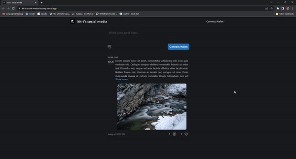
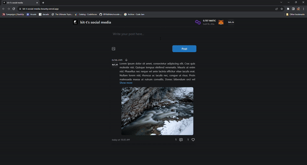
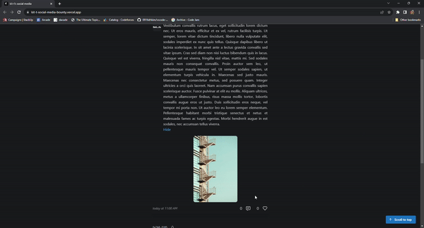
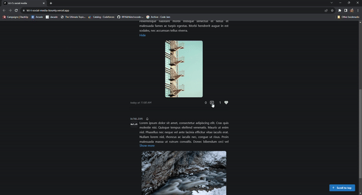
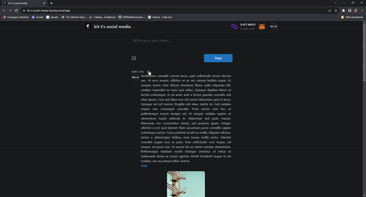
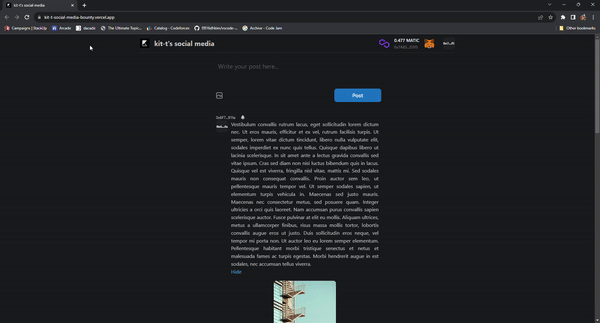
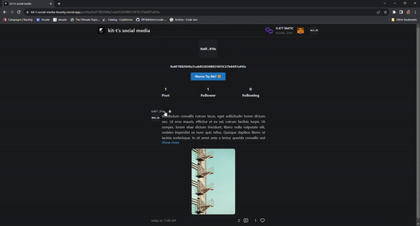
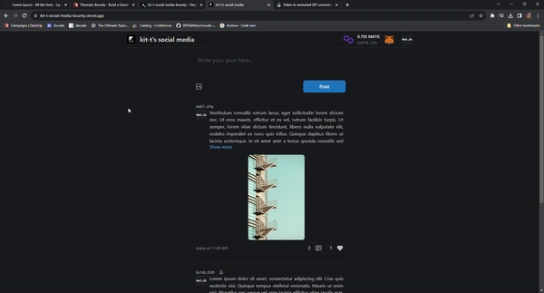

<br />
<div align="center">
  <a href="https://github.com/teyweikiet/stackup-social-media-dapp-bounty">
    
  </a>

  <h1 align="center" style="border-bottom: 0;">kit-t's social media</h1>

  <p align="center">
    A full stack social media Dapp!
    <br />
    <a href="https://kit-t-social-media-bounty.vercel.app/"><strong>View Demo</strong></a>
    |
    <a href="https://mumbai.polygonscan.com/address/0x3123029f0a013ACC70f67b0cc3CB1D0D90fb3b18#code"><strong>View Contract</strong></a>
    <br />
  </p>
</div>

<details>
  <summary>Table of Contents</summary>
  <ol>
    <li>
      <a href="#about-the-project">About The Project</a>
      <ul>
        <li><a href="#functionalities">Functionalities</a></li>
      </ul>
    </li>
    <li>
      <a href="#built-with">Built With</a>
      <ul>
        <li><a href="#backend">Backend</a></li>
        <li><a href="#frontend">Frontend</a></li>
      </ul>
    </li>
    <li>
      <a href="#getting-started">Getting Started</a>
      <ul>
        <li><a href="#prerequisites">Prerequisites</a></li>
        <li><a href="#installation">Installation</a></li>
      </ul>
    </li>
    <li>
      <a href="#how-tos">How Tos</a>
      <ul>
        <li><a href="#connect-wallet-to-platform">Connect Wallet to Platform</a></li>
        <li><a href="#create-post-with-image-visual">Create Post with Image Visual</a></li>
        <li><a href="#like-a-post">Like A Post</a></li>
        <li><a href="#create-and-like-a-comment">Create And Like A Comment</a></li>
        <li><a href="#follow-another-user">Follow Another User</a></li>
        <li><a href="#visit-a-user-profile">Visit A User Profile</a></li>
        <li><a href="#tip-a-user">Tip A User</a></li>
        <li><a href="#visit-own-profile-and-check-earnings">Visit Own Profile And Check Earnings</a></li>
      </ul>
    </li>
  </ol>
</details>

## About the project

This is a submission for [StackUp's Build a Social Media Dapp Bounty](https://app.stackup.dev/bounty/build-a-social-dapp).

### Functionalities

- user can connect wallet to the social media platform
- user can create post with text and image. Image are hosted using decentralised storage solution.
- user can see all posts created by every user on the platform in descending time of creation
- user can add a comment on a post and see the list of comments on a post
- user can like a comment and a post
- user can follow another user
- user can tip another user and see total amount of tips received
- user can see each other profile which includes statistics about follower, following and also a list of posts created by the user

## Built With

### Backend

- Hardhat for deployment & verification of Solidity smart contract

- Polygon Mumbai as EVM testnet for the smart contract

### Frontend

- Next.js as framework for frontend web app development

- Mantine for building beautiful, responsive & accessible components

- Thirdweb SDK for connecting to user wallet, interacting with smart contract on testnet and decentralised file storage

- Ethersjs for utils to interact with smart contract

- Dayjs for formatting timestamp

- Vercel for hosting frontend app: https://kit-t-social-media-bounty.vercel.app/

## Getting Started

### Prerequisites

- Install Node.js 18

### Installation

1. Clone the repo
```sh
git clone https://github.com/teyweikiet/stackup-social-media-dapp-bounty
```

#### Backend

1. Go to backend directory
```sh
cd backend
```

2. Install NPM packages
```sh
npm install
```

3. Create .env and modify accordingly
  - Get polygonscan api key [here](https://polygonscan.com/myaccount). [[how-to](https://docs.polygonscan.com/getting-started/viewing-api-usage-statistics)]
  - [To get wallet's private key in Metamask](https://support.metamask.io/hc/en-us/articles/360015289632-How-to-export-an-account-s-private-key)
```sh
cp .env.example .env
```

4. Compile and deploy smart contract to polygon mumbai
```sh
npm run compile
npm run deploy:mumbai
```

5. Get the address from console and use it for env in frontend

#### Frontend

1. Go to frontend directory
```sh
cd frontend
```

2. Install NPM packages
```sh
npm install
```

3. Create .env and modify accordingly
  - Get thirdweb client id [here](https://thirdweb.com/create-api-key). [[how-to](https://portal.thirdweb.com/api-keys#creating-an-api-key)]
```sh
cp .env.example .env
```

## How tos

### Connect Wallet to Platform



### Create Post with Image Visual



### Like A Post



### Create And Like A Comment



### Follow Another User



### Visit A User Profile



### Tip A User



### Visit Own Profile And Check Earnings


